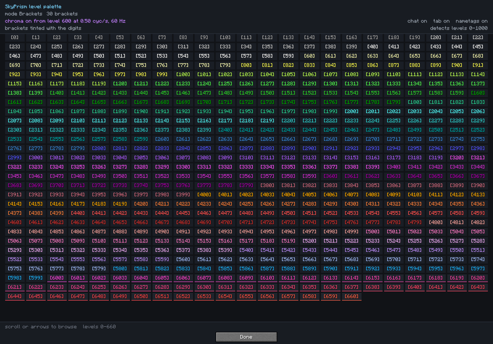
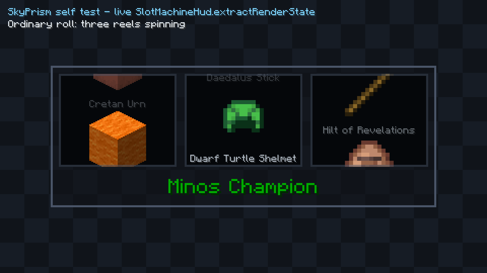
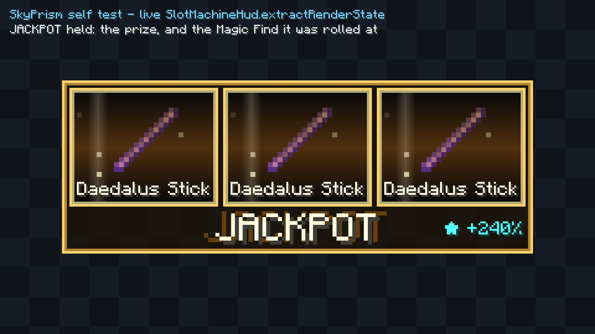
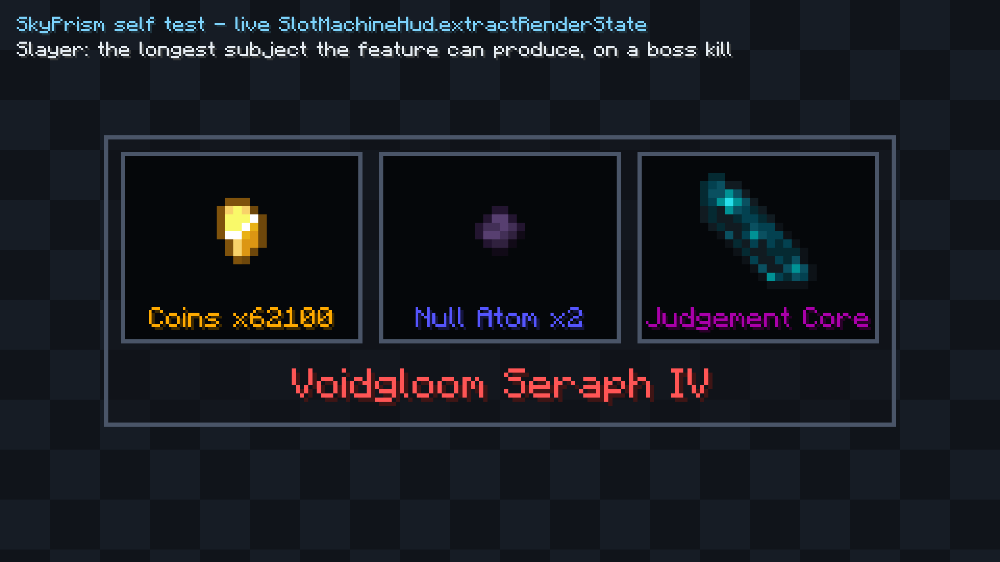
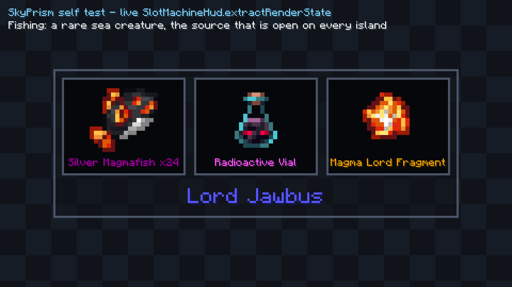
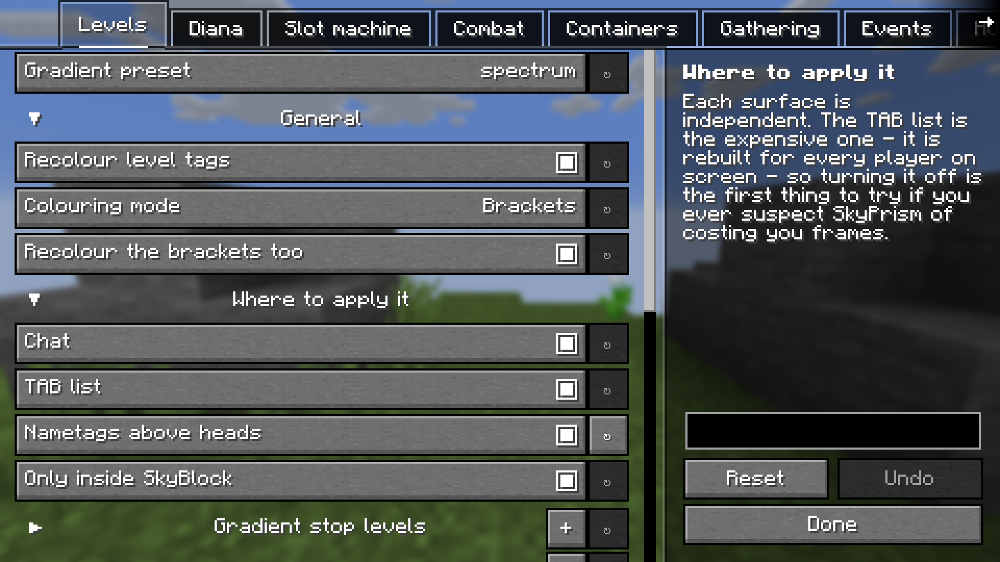

# SkyPrism

A Fabric client mod for **Hypixel SkyBlock** that does two things: it gives the SkyBlock level prefix
a proper colour range, and it turns every lucky drop in the game into a slot machine.

Built for Minecraft **26.1.2** and **26.2**. Client-side only — it reads what the server already sent
you and draws it differently. It never sends anything to Hypixel.

---

## What it actually does

### 1. Twice as many level colours below 480, and thirteen new ones above it

Hypixel gives your `[451]` level prefix one of **13** colours, changing once every 40 levels. So a
level 200 and a level 239 look identical. And 480 is Hypixel's *last* tier — level 480, level 537 and
level 600 are all the same dark red, forever.

SkyPrism raises the resolution without throwing the scheme away.

**Below 480 the colour changes every 20 levels instead of every 40, and it changes to Hypixel's own
colours.** Every other band is a real tier colour on the exact level Hypixel switches at; the band
between two of them is the midpoint of that pair, mixed in a perceptual colour space so it doesn't
go muddy on the way across. The colours you already read stay where they are. There are twice as
many of them.

**Above 480 it changes every 10 levels**, in thirteen colours of SkyPrism's own — rose up through
violet to cyan, alternating vivid and pale so that even ten levels apart is obvious. That is the
stretch Hypixel paints one flat red, so nothing here is being overwritten and it is where telling two
players apart is worth the most.

Applies in chat, in TAB, and optionally above heads.



That's `/skyprism preview`, showing the live palette. The underline marks where animated chroma kicks
in — it ships off, and starts at level 600 when you switch it on.

Want something else? The mode is a dropdown: **Gradient** gives every single level its own shade
along one of eleven ramps, **Vanilla** reproduces Hypixel's thirteen tiers untouched, and every band
and every stop is editable with a colour picker.

### 2. Lucky drops become a slot machine

When you get something worth getting, a slot machine spins in the corner and its reels land on the
items you **actually** got — read out of chat, not invented.



If one of them is genuinely rare, the machine doesn't stop there. Gold floods in *while the reels are
still turning*, they break loose and spin up again, and they land one at a time — all three on the
same item. Casino three-of-a-kind.



The `✦ +240%` is the Magic Find that earned it. It only shows when Hypixel actually reports one.

**This fires across the whole game, not just one event.** 64 sources: slayer bosses, dungeon chests,
Crystal Hollows chests, rare sea creatures, tree gifts, Diana's mythological creatures, gemstones,
Garden pests, chocolate rabbits, dragons, Kuudra, trapper animals, and more.

 

Each source knows how often it fires and behaves accordingly — an Inquisitor spins the machine every
time, ordinary fishing catches don't, or you'd never see anything else. All of it is per-source
configurable.

---

## Install

1. Minecraft **26.1.2** (or 26.2) with **Fabric Loader 0.19.3+** and **Java 25**
2. [Fabric API](https://modrinth.com/mod/fabric-api)
3. `skyprism-1.0.4+26.1.2.jar` (or `skyprism-1.0.4+26.2.jar`) from [Releases](../../releases)
   → your `mods/` folder
4. *Optional but recommended:* [YACL](https://modrinth.com/mod/yacl) and
   [Mod Menu](https://modrinth.com/mod/modmenu) for the settings screen

Without YACL the mod still runs — you just get no settings GUI. Grab the jar matching your Minecraft
version; they are not interchangeable.

## Try it in 30 seconds

You don't need a Diana mayor, a dungeon run, or any luck at all:

```
/skyprism simulate inq                  a Minos Inquisitor kill, full roll
/skyprism simulate inq Chimera          ...that pays out, so you see the jackpot
/skyprism simulate slayer_boss          a slayer drop
/skyprism preview                       the level palette
/skyprism hud                           drag the machine wherever you want it
```

## Commands

| Command | What it does |
| --- | --- |
| `/skyprism` | Status: what's on, what's off, where the config lives |
| `/skyprism preview` | The level palette, browsable from 0 to past the chroma threshold — 0–660 on shipped defaults, or give it your own `[min] [max]` |
| `/skyprism hud` | Drag the machine into position |
| `/skyprism simulate <source> [drops…]` | Run any source's full pipeline offline |
| `/skyprism sources` | Every source, its policy, and whether its gate is open right now |
| `/skyprism stats` | Kills, rolls, jackpots, drop tallies |
| `/skyprism profile` | Performance counters, so "it's lightweight" is checkable |
| `/skyprism reload` | Re-read the config from disk |

`/skyprism sources` is the one to reach for if something *isn't* firing — it prints each source's gate
so you can see whether the mod thinks you're somewhere else.

## Settings



Mod Menu → SkyPrism. Colours (bracket table / gradient / vanilla, presets, chroma, which surfaces),
per-source roll policies grouped by category, HUD position and scale, and sounds. Full reference in
[docs/CONFIG.md](docs/CONFIG.md).

## Does it cost FPS?

No, and it's measured rather than asserted. When no roll is on screen the HUD's render method returns
on its first line without allocating. Sources you aren't near aren't just skipped — they aren't
registered at all, so a slayer detector costs literally nothing while you're fishing. TAB recolouring
is memoised per player. There are no threads, no polling loops, and no network calls anywhere in the
mod. `/skyprism profile` shows the real numbers.

---

## Known limits — please read this bit

**Only the Diana path has been confirmed against the live server.** The other 51 chat detectors were
built by reading two well-established open-source mods' pattern corpora, and their strings have never
been seen arriving from Hypixel by this project.

That matters because **a wrong pattern fails silently**. The gate opens, nothing matches, nothing gets
logged, and it looks exactly like a feature that doesn't work rather than one that's mis-tuned.

So if a source never spins for you:

1. Run `/skyprism sources` and check whether that source's gate is even open
2. If the gate is open but nothing fires, the pattern is likely wrong — **that's a genuinely useful
   bug report.** Copy the exact chat line (with `F3+D` off so formatting survives, or just paste what
   you saw) and open an issue
3. `/skyprism simulate <source>` confirms the machine and the HUD are fine independently of detection

Also honest:

- **Item art** for non-Diana loot uses vanilla lookalikes. Real Hypixel item art gets learned the
  first time the mod sees a drop in your inventory, then remembered permanently.
- **Six GUI-triggered sources** (Croesus, reward chests, the Experimentation Table, Ubik's game) have
  their screen-title hooks wired but their exact titles unconfirmed.
- **Magic Find doesn't apply to Catacombs chest loot** — that's Hypixel's design, not a bug here. A
  dungeon chest roll showing no `✦` figure is correct.
- Another player's drop being broadcast to you deliberately **won't** spin your machine. If ownership
  can't be established the line is declined, so a missed roll is possible; celebrating someone else's
  Chimera is not.

---

## Building it yourself

```bash
./gradlew buildAllVersions     # both jars -> build/libs/<version>/
./gradlew testAllVersions      # the fast suite, no Minecraft on the classpath
./gradlew mcTestAllVersions    # the Minecraft-aware suite
```

Needs **JDK 25** (the daemon JVM is pinned via `gradle/gradle-daemon-jvm.properties`, so a JDK 25 gets
provisioned or located for you). It's a [Stonecutter](https://stonecutter.kikugie.dev/) project: one
source tree builds both Minecraft versions, currently with **zero** version-conditional code.

4510 tests run across both versions. The core logic is deliberately Minecraft-free so it tests on a
bare JVM in about a second.

There's also an in-client self test that opens every screen and screenshots it — every image in this
README came out of it:

```bash
./gradlew :26.2:runClient -Dskyprism.selftest=true
```

## Docs

| | |
| --- | --- |
| [ARCHITECTURE.md](docs/ARCHITECTURE.md) | How it fits together and why |
| [CHAT-PATTERNS.md](docs/CHAT-PATTERNS.md) | Every Hypixel string relied on, and how to fix one when it breaks |
| [CONFIG.md](docs/CONFIG.md) | Every setting |
| [TESTING.md](docs/TESTING.md) | Test layout, the self test, manual acceptance checklist |
| [CONTRIBUTING.md](CONTRIBUTING.md) | Working on it |

If Hypixel changes a chat message, `CHAT-PATTERNS.md` names the exact file and line for every pattern.
That's the fragile surface, and it's documented on purpose.

## Licence

MIT — see [LICENSE](LICENSE).

Chat patterns were cross-referenced against [SkyHanni](https://github.com/hannibal002/SkyHanni) and
[Skyblocker](https://github.com/SkyblockerMod/Skyblocker), both open source. Not affiliated with
Hypixel or Mojang.
