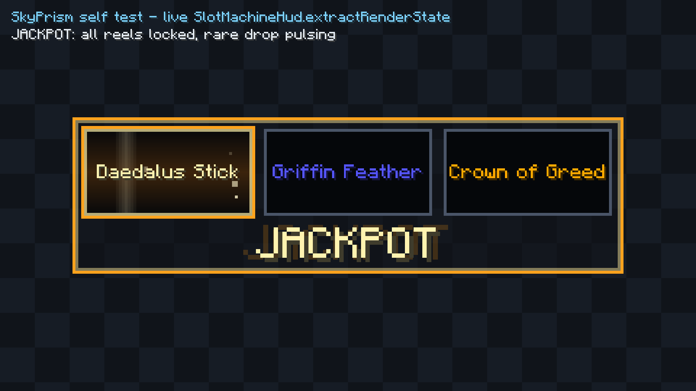

# SkyPrism configuration

Every setting SkyPrism has, what it does, and what happens to the file that holds them.

Nothing here is invented: the names come from
`src/main/resources/assets/skyprism/lang/en_us.json`, the keys and defaults from
`com.skyprism.core.config.SkyPrismConfig`, and the ranges from the `MIN_`/`MAX_` constants that
class publishes and clamps against.

---

## Where the file lives

```
<minecraft>/config/skyprism/config.json
```

`ConfigManager` resolves that through `FabricLoader.getInstance().getConfigDir()`. If the loader
is not available — a harness, a very early crash — it falls back to `./config/skyprism/config.json`
relative to the working directory and logs a warning.

Two other SkyPrism files sit **directly** in `config/`, not in the `skyprism/` subfolder:

| File | Written by | What it is |
|---|---|---|
| `config/diana_stats.json` | `DianaStats` | the session-to-session kill/roll/jackpot tally `/skyprism stats` prints |
| `config/skyprism.json` | `DianaController` | a standalone config read **only** when the command module's config service was never registered; the normal client never reads it |

The file is pretty-printed with HTML escaping off, and field order follows declaration order in
`SkyPrismConfig`. A save that changed nothing produces a byte-identical file, so it is safe to keep
under version control.

## Editing it by hand

The file is JSON with no `@SerializedName` anywhere, so **every JSON key is exactly the Java field
name**, nested under `levels`, `diana`, `loot`, `hud` and `sounds`. The one place a key is not a
field name is `loot.sources`, which is a map keyed by loot source — those keys are enum constants,
so they are upper case with underscores (`"SLAYER_BOSS"`).

You can edit it with the game running and pick the change up with `/skyprism reload`, which calls
`ConfigManager.load()` and bumps the generation counter every cached render is keyed on — TAB and
chat repaint without a restart.

A field you leave out is not an error. Gson runs the no-argument constructor first, so an absent
field simply keeps the default written in its field initialiser. That is why adding a setting in a
later release needs no migration.

Nothing you can write will throw. `SkyPrismConfig.sanitized()` runs on every load and every save,
and it repairs rather than rejects: numbers are clamped, `null` is replaced, an unrecognised enum
name (which Gson delivers as `null`) is dropped, tables are sorted and de-duplicated. `sanitized()`
is documented as never throwing — not "should not" — because it sits between the disk and the render
thread. The value you see in the screen after a reload is the repaired one, not what you typed.

---

## Top level

| Screen | JSON key | Default | Range | What it does |
|---|---|---|---|---|
| — | `configVersion` | `5` | clamped 1–5 | Schema version of the file. Written by the mod; see [Versioning](#versioning-and-migration). |
| — | `debugLogging` | `false` | boolean | Intended as extra logging of parse decisions for someone reporting a mis-detected tag. **It is carried through load, save, copy and equality but no code in the mod currently reads it**, so turning it on changes nothing today. |

Neither appears in the settings screen.

---

## Levels

The `[451]` prefix recolour. Screen category **Levels**; JSON group `levels`.


### General

| Screen | JSON key | Default | Range | What it does |
|---|---|---|---|---|
| Recolour level tags | `levels.enabled` | `true` | boolean | Master switch. Off leaves Hypixel's own thirteen tier colours alone everywhere. |
| Colouring mode | `levels.mode` | `BRACKETS` | `GRADIENT`, `BRACKETS`, `VANILLA` | Which of the three colour sources is live. `BRACKETS` gives every level inside a band one flat colour, and is the shipped mode — see [defaults worth knowing about](#defaults-worth-knowing-about) for the table it ships with and why. `GRADIENT` interpolates a ramp instead, so 250 and 251 are a hair apart. `VANILLA` reproduces Hypixel's own 13 forty-level tiers byte for byte. |
| Recolour the brackets too | `levels.recolourBrackets` | `true` | boolean | Whether the `[` and `]` take the level colour, or stay exactly as Hypixel drew them so only the digits change. Turn it **off** for Hypixel's own dim-bracket styling. See [defaults worth knowing about](#defaults-worth-knowing-about). |

### Where to apply it

| Screen | JSON key | Default | Range | What it does |
|---|---|---|---|---|
| Chat | `levels.applyToChat` | `true` | boolean | Recolour the prefix in chat lines. Checked by `ChatRouter` before it touches a message. |
| TAB list | `levels.applyToTabList` | `true` | boolean | Recolour the prefix in the TAB player list. Results are memoised per player, so the cost is a rebuild when a name changes rather than a cost per frame. |
| Nametags above heads | `levels.applyToNameTags` | `false` | boolean | Recolour the prefix on above-head name tags. See [defaults worth knowing about](#defaults-worth-knowing-about). |
| Only inside SkyBlock | `levels.onlyOnSkyBlock` | `true` | boolean | Restrict all recolouring to Hypixel SkyBlock. The signal is the sidebar objective title, re-read every 2 s, so the check costs one boolean read. |

`onlyOnSkyBlock` is the setting most worth leaving alone. `LevelTagLocator` is careful about the
*shape* of what it matches — no leading zeros, a nine-digit cap, a letter-or-digit boundary rule, a
configurable level range — but it cannot tell which server a token came from and there is no
positional constraint: the hook sees every game message and every TAB row everywhere. With this off,
a teammate typing "we need `[2]` more" in a Bedwars lobby, a shared coordinate `[500] [70]`, or
another mod's "`[3]` updates available" all get repainted with the SkyBlock level ramp.

One caveat worth knowing: if the Diana module cannot be reached at all, `levelScopeSatisfied` **errs
open** and recolours everywhere, logging a one-time warning. That is deliberate — a broken Diana HUD
must not cost you your level colours — but it means "only inside SkyBlock" is a scope, not a
guarantee.

### Palette source

| Screen | JSON key | Default | Range | What it does |
|---|---|---|---|---|
| Gradient preset | `levels.gradientPreset` | `"spectrum"` | `spectrum`, `vanilla_plus`, `aurora`, `ocean`, `sunset`, `ember`, `toxic`, `neon`, `candy`, `rainbow`, `mono`, `custom` | Which shipped ramp `GRADIENT` mode draws with, or `custom` to use `customStops`. Read only in `GRADIENT` mode, which is not the shipped mode, so changing this does nothing until you switch `levels.mode` over. Names are normalised on load: case is folded and a space becomes an underscore, and anything still unrecognised falls back to `spectrum`. |
| Gradient stop levels / Gradient stop colours | `levels.customStops` | the 16 `spectrum` stops | 1–64 entries | Your own ramp: a list of `{ "level": int, "rgb": int }`. Used when `gradientPreset` is `"custom"`. Seeded from whatever the default preset is, so switching to `custom` starts from what you were already looking at. |
| Bracket start levels / Bracket colours | `levels.brackets` | 37 bands: 0–479 every 20 levels, then 480–600 every 10 | 1–64 entries | Your own step table: a list of `{ "minLevel": int, "rgb": int }`. Used in `BRACKETS` mode — which is the shipped mode, so this is the table a fresh install actually draws with. Where the 37 come from is in [defaults worth knowing about](#defaults-worth-knowing-about). |

Both tables are sanitised the same way. Levels are clamped to 0–999,999,999, the list is sorted by
level, duplicates are dropped (first one at a level wins, and the de-duplication runs *after* the
clamp because clamping can itself collide two entries), and the list is truncated at 64. A list that
ends up empty is replaced with the shipped default rather than left with no colours in it.

`rgb` is a plain decimal integer in the JSON because that is what Gson writes for an `int`. White is
`16777215`, not `"#FFFFFF"`.

In the settings screen each table is split into two parallel lists — levels and colours — that are
zipped back together on save, stopping at the shorter of the pair. Switching the preset dropdown to
a shipped ramp overwrites both custom-stop lists with that ramp's stops; switching it to `custom`
leaves them alone. All three tables are kept in the file at once, rather than in a tagged union, so
flipping between `GRADIENT` and `BRACKETS` to compare them does not throw away whichever one you are
not currently looking at.

#### The shipped presets

| Key | Range | Character |
|---|---|---|
| `spectrum` | 0–600 | **The default ramp**, drawn the moment you switch to `GRADIENT`. 300° of hue at a fixed perceptual lightness — teal, green, gold, orange, coral, pink, magenta, violet, sky. |
| `vanilla_plus` | 0–480 | Hypixel's own thirteen tier colours as gradient stops, smoothed between them. The familiar look. |
| `aurora` | 0–500 | Blue, teal, green, violet, pink. A northern-lights sweep. |
| `ocean` | 0–600 | Pale aqua down through teal and azure into a vivid deep blue. |
| `sunset` | 0–500 | Dusk violet through magenta and orange up to pale gold. |
| `ember` | 0–600 | A coal glowing up: deep red, orange, gold, pale ash-gold. |
| `toxic` | 0–600 | Dark moss climbing through acid green and chartreuse to bleached yellow. |
| `neon` | 0–600 | Every stop pushed to the edge of the sRGB gamut. Deliberately loud. |
| `candy` | 0–600 | The same hue sweep as `spectrum` in chalk: high lightness, barely any chroma. |
| `rainbow` | 0–500 | A full hue sweep, red round to magenta. |
| `mono` | 0–500 | Grey to white. No hue at all, for a level that is legible but not loud. |

A ramp's range is only where its stops are; `GradientRamp` clamps outside them, so every preset
returns a sane colour at level 900.

Adding a preset is one line in `PalettePresets.gradients()` — the settings dropdown is built off
that map. Two rules are enforced by `PalettePresetsTest` on every entry in it, including entries
added later:

- **Structure.** Stops strictly ascend, start at level 0, reach at least 480, and no two stops share
  a level. Between adjacent levels the colour never moves more than one just-noticeable step, so
  there is no visible seam at a stop boundary.
- **Legibility.** Every level on every ramp is measured for WCAG contrast against `#14151C`, which
  is roughly where chat's scrim and the TAB panel sit over a dark scene, and must clear 2.0:1. This
  is not a text-accessibility grade — Hypixel's own `0xAA0000` top tier only manages 2.3:1, so a
  4.5 bar would fail the preset whose entire job is to reproduce Hypixel. It is set to catch the
  failure that actually happens: a navy or deep-violet band that vanishes completely against TAB.
  `sunset` used to open on `0x4B2E83` and scored 1.7:1; its first stop was lifted to a legible
  lightness at the same hue, and the rest of that ramp is untouched. `spectrum` is held to 7.0:1 on
  top of that, because it is the ramp `GRADIENT` gives someone who has not picked one.

The shipped bracket table is measured the same way, on a split bar that says plainly what the table
is: SkyPrism wrote the colours above 480, so they are held to the same 7.0:1 as `spectrum`. Below
480 it is reproducing Hypixel's own hexes on purpose, and those clear only the 2.0 floor —
`0xAA00AA` at level 360 measures 2.85:1 and is the table's worst case. Raising that bar would mean
abandoning the vanilla list, which is the one thing players asked us not to do.

### Chroma

The animated hue sweep for high-level tags.

| Screen | JSON key | Default | Range | What it does |
|---|---|---|---|---|
| Enable chroma | `levels.chromaEnabled` | `false` | boolean | Whether tags at or above the threshold get the animated sweep on top of their base colour. |
| Chroma from level | `levels.chromaMinLevel` | `600` | 0–999,999,999 | Lowest level that shimmers. 600 keeps the shimmer at the very top of the ladder, where it reads as extraordinary rather than as decoration — it replaces the palette colour outright, so once a dozen tags in a lobby shimmer there is nothing left to escalate to. The screen offers this as a free-entry number field, so the clamp is what actually bounds it. |
| Chroma speed | `levels.chromaCyclesPerSecond` | `0.35` | 0.01–10.0, NaN → 0.35 | Full trips around the hue wheel per second. Past the top end it reads as a strobe rather than as colour. |
| Chroma refresh rate | `levels.chromaUpdateHz` | `30` | 1–240 | How often the shimmer colour is recomputed, decoupled from frame rate. At 30 Hz a shimmering TAB entry is rebuilt at most once every 33 ms however fast the client renders. |
| Chroma saturation | `levels.chromaSaturation` | `0.90` | 0.0–1.0, NaN → 0.90 | How vivid the sweep is. At 0 it becomes a moving grey. |
| Chroma lightness | `levels.chromaLightness` | `0.62` | 0.0–1.0, NaN → 0.62 | How light the sweep is. Near either end the hue stops being visible and the tag looks frozen black or white; the useful band is roughly 0.5–0.7. Both ends stay legal because a clamp that rejected them would have to guess which way you meant to go. |

Saturation and lightness were hard-coded in the adapter until schema v3. If your file came from v2 it
carries them explicitly at `0.90` and `0.62` — see [Versioning](#versioning-and-migration).

`chromaMinLevel` shipped at `400` before, and moving the default did **not** move anybody's setting.
Every build of the mod writes the key out explicitly, so an existing `config.json` already carries a
number and Gson binds that over the new default; `600` is what a fresh install gets, or a file with
the key deleted. There is no migration for this and none is wanted — see
[Versioning](#versioning-and-migration) for the cases that do need one.

The palette preview sizes its own range from this setting rather than from a fixed `0–600`, so the
shimmering band is always several rows deep on screen whether you run the threshold at 300, at the
shipped 600, or at 800.

### Tag detection

Collapsed by default in the screen.

| Screen | JSON key | Default | Range | What it does |
|---|---|---|---|---|
| Lowest level | `levels.minLevel` | `0` | 0–999,999,999 | Smallest number accepted as a level tag. Below it, `[12]` is left alone as ordinary text. |
| Highest level | `levels.maxLevel` | `1000` | 0–999,999,999 | Largest number accepted as a level tag. |

An inverted range is repaired by **widening** — `minLevel` becomes the smaller of the two and
`maxLevel` the larger — rather than by snapping one bound onto the other, so whichever bound you
edited last, the levels you were plainly trying to include stay included.

---

## Diana

Kill detection and loot capture for the Mythological Ritual. Screen category **Diana**; JSON group
`diana`.

### General

| Screen | JSON key | Default | Range | What it does |
|---|---|---|---|---|
| Enable the slot machine | `diana.enabled` | `true` | boolean | Master switch for kill detection and the machine. With it off, `ChatRouter` never offers a line to the Diana controller at all. |
| Only my own burrows | `diana.onlyMyBurrows` | `true` | boolean | Turning this **off** additionally accepts the server-wide "shared Minos Inquisitor" broadcast as a spawn, so someone else's announced inquisitor arms the machine too. On (the default) only your own spawn lines count. Note that this is narrower than the field's own javadoc suggests: it is the only branch in `DianaController` that reads the flag. |
| Hide the drop lines in chat | `diana.suppressDropChatLines` | `false` | boolean | Once the machine has captured a drop line, hide it from chat so the reels are the announcement rather than a duplicate of it. Only lines that actually reached a reel are hidden. |

### Islands

| Screen | JSON key | Default | Range | What it does |
|---|---|---|---|---|
| Islands | `diana.allowedAreas` | `[]` (empty) | up to 128 entries | Islands the feature may run on, matched against the sidebar's area line. **Empty means "any island"** — that polarity is chosen so an unconfigured gate works everywhere rather than silently working nowhere. |

Fill it in to stop unrelated content being credited to Diana. The loot parser recognises Hypixel's
banners server-wide, so a slayer or dungeon `RARE DROP!` landing inside a stale spawn's lifetime is
otherwise offered to the reels and written into the tally. Entries are formatting-stripped,
whitespace-collapsed and matched case-insensitively, so `Hub` and `§7 hub ` are the same entry. With
a non-empty list an *unknown* area is treated as closed.

### Trigger creatures

| Screen | JSON key | Default | Range | What it does |
|---|---|---|---|---|
| one tick box per creature | `diana.triggers` | `["MINOS_INQUISITOR", "KING_MINOS", "MANTICORE"]` | any subset of the 12 names below | Which creatures spin the reels. |

The twelve legal names, which are the enum constants and are what the JSON holds:

`GAIA_CONSTRUCT`, `MINOTAUR`, `MINOS_CHAMPION`, `SIAMESE_LYNXES`, `MINOS_HUNTER`, `CRETAN_BULL`,
`HARPY`, `STRANDED_NYMPH`, `SPHINX`, `MINOS_INQUISITOR`, `KING_MINOS`, `MANTICORE`.

The last four are the ones the mod classes as rare; only three of them are triggers by default.
Unrecognised names are dropped on load (Gson turns them into `null`, and the sanitiser removes
those), and the surviving set is rewritten in enum order so the file is stable no matter what order
you ticked the boxes in.

An **empty** set is legal and is not the same statement as `enabled = false`: parsing still runs, so
chat-side behaviour and the tally continue while nothing ever spins. A set that is missing entirely
returns to the defaults; a set you emptied yourself stays empty.

### Timing

Collapsed by default in the screen. All values are milliseconds.

| Screen | JSON key | Default | Range | What it does |
|---|---|---|---|---|
| Reels | `diana.reelCount` | `3` | 1–5 | Columns on the machine. |
| Loot window | `diana.lootWindowMillis` | `3000` | 250–30,000 | How long after a kill drops are still attributed to it. Under a quarter second the ordinary drop lines that follow a kill fall outside it and the reels lock onto nothing; past thirty seconds the next kill's drops start bleeding in. |
| Spin length | `diana.spinMillis` | `1200` | 0–10,000 | Free-spin time before the leftmost reel locks. |
| Lock stagger | `diana.lockStaggerMillis` | `250` | 0–2,000 | Extra delay per reel, so they stop left to right. |
| Hold after settling | `diana.settleMillis` | `2500` | 0–15,000 | How long the finished result is held still. |
| Fade out | `diana.fadeMillis` | `500` | 0–5,000 | How long the result takes to fade afterwards. |
| Jackpot gold wash | `diana.jackpotIntroMillis` | `600` | 0–5,000 | How long the gold takes to wash in. Every reel breaks loose at the *start* of it, so this measures the colour ramp rather than a pause before the machine moves. 0 makes the gold snap on. |
| Jackpot re-spin | `diana.jackpotSpinMillis` | `900` | 0–10,000 | How much longer the reels keep turning once the wash is complete, before the first one lands. |
| Jackpot lock stagger | `diana.jackpotLockStaggerMillis` | `280` | 0–2,000 | Delay per reel in the second act, so the three of a kind lands column by column. 0 lands them together. |
| Jackpot hold | `diana.jackpotHoldMillis` | `2200` | 0–15,000 | How long the three of a kind is held before the fade. |

These clamps are chosen so `DianaSettings.toRollConfig()` can never hand the roll engine an argument
`SlotRollConfig`'s constructor would reject.

The last four drive a second act that only a jackpot ever plays, and that starts only once the
ordinary roll has finished honestly — the reels lock on the real drops with no hint of gold, and
*then* the machine washes gold, spins all three columns back up and lands them one at a time on the
same item. The old `diana.jackpotExtraSpinMillis` is gone: it was spent inside the ordinary spin, so
a jackpot roll looked different from its first second and gave the surprise away. A file still
carrying that key binds nothing and keeps the new defaults.

### Jackpot items

| Screen | JSON key | Default | Range | What it does |
|---|---|---|---|---|
| Jackpot items | `diana.jackpotItems` | the six names below | up to 128 entries | A player-editable list of item names considered a jackpot. **Read the note below — this list does not currently drive the on-screen flourish.** |

Defaults: `Daedalus Stick`, `Crown of Greed`, `Minos Relic`, `Dwarf Turtle Shelmet`,
`Antique Remedies`, `Washed-up Souvenir`.

Matching strips colour codes and surrounding whitespace from **both** sides and ignores case, so a
name pasted straight out of chat with its formatting codes still attached matches a typed one.
Entries that clean to blank are dropped; insertion order is kept because it is the order the screen
lists them in.

**What actually reads it, today.** `DianaSettings.isJackpot(...)` has exactly two callers, both in
`SkyPrismCommands`: the echo `/skyprism simulate` prints, which marks matching drops with a `*`, and
its drop-name suggestion path. Nothing else in the mod consults it.

The live slot machine decides a jackpot somewhere else entirely. `SlotRoll.offerDrop` latches the
flourish when `LootDrop.rare()` is set, which `LootParser` sets from Hypixel's own
`RARE DROP!` / `VERY RARE DROP!` / `CRAZY RARE DROP!` / `INSANE DROP!` banner on the line. There is
also a third mechanism, `JackpotRule`, with its own seventeen-item shipped list built from wiki drop
rates; it is used by `SimulatedLoot` to pick plausible rare drops for `/skyprism simulate`, and by
nothing on the live path.

So editing this list changes what `/skyprism simulate` marks as a jackpot in its chat echo, and
nothing about what the reels do on a real kill. The field's own javadoc — "Item names that trigger
the jackpot flourish" — describes an intent the wiring does not yet carry out. Treat this as a known
gap rather than as a setting that works.

---

## The rest of SkyBlock

The same slot machine, on every other chance-based event in the game. Screen categories **Slot
machine**, **Combat**, **Containers**, **Gathering** and **Events**; JSON group `loot`.

### The shape of it, in one paragraph

There is one constant per chance-based activity — sixty-odd of them — and each carries an on/off
switch, a *roll policy* saying when it may spin, and optionally its own jackpot list. Those three
sit behind a per-category switch and a global master, and all of them have to agree before a source
spins. Almost nobody will touch more than two or three, so the file is **sparse**: only sources you
have actually formed an opinion about are written to it, and a fresh install writes
`"sources": {}`.

### Top of the group

| Screen | JSON key | Default | What it does |
|---|---|---|---|
| Enable the SkyBlock-wide slot machine | `loot.enabled` | `true` | One switch covering every source below. **It does not cover Diana.** |
| Hide the drop lines in chat | `loot.suppressDropChatLines` | `false` | As `diana.suppressDropChatLines`, but for the new sources. Two fields, so you can hide one and not the other. |
| the four category switches | `loot.disabledCategories` | `[]` | The categories you have switched off wholesale, by name. Empty means all on, which is why a category added in a later release arrives switched on. |
| the per-source table | `loot.sources` | `{}` | Keyed by source id in upper case, e.g. `"SLAYER_BOSS"`. Absent means "no opinion". |

### Why Diana is not under the master switch

`loot.enabled` governs everything **except** Diana, which keeps `diana.enabled` on its own tab. That
is structural rather than tidy: `DianaController` reads `config.diana` directly, so a master switch
that claimed to cover Diana would be a claim the config class could not keep, and the two would
disagree about whether Diana was on. The Diana path is the only one verified against the live
server, and nothing in the new machinery is allowed to change what it does.

To silence everything new without touching Diana, turn `loot.enabled` off. `SkyPrismConfig` exposes
`effectiveSource(LootSource)` as the one place that resolves a source to an answer, and it is what
routes Diana to `diana` and everything else to `loot`.

### One source

Each entry has three fields, all optional:

| JSON key | Default | What it does |
|---|---|---|
| `enabled` | `true` | Whether this source may spin. The master, the category and this must all be on. Switching a category back on does **not** undo a source you disabled by name. |
| `policy` | *absent* | One of `ALWAYS`, `ON_RARE_BANNER`, `ON_JACKPOT_ITEM_ONLY`, `NEVER`. **Absent means "whatever this build ships"** — see below. |
| `overrideJackpotItems` + `jackpotItems` | `false` + `[]` | Replaces the shipped jackpot list. The boolean is what separates "I have not touched it" from "I want nothing celebrated here", which a bare empty list cannot express. |

An entry with all three at their defaults is dropped when the file is written, which is what keeps
a config with sixty-odd configurable sources down to the handful of lines you actually edited.

**Absent `policy` is not the same as writing the default in.** A source you have never touched
stores nothing and reads through to this build's default, so a later SkyPrism that corrects a
default it got wrong reaches you. A policy you *wrote* is kept verbatim and never rewritten, even
into a value that happens to equal the current default. The way back to "no opinion" is the reset
button on each category tab, or deleting the entry by hand — the screen's dropdown cannot express
it, because writing a value there is by definition an opinion.

**Two policies are demoted rather than obeyed.** `ON_RARE_BANNER` on a source Hypixel prints no
rarity flag for, and `ON_JACKPOT_ITEM_ONLY` on a source whose effective list is empty, are both
settings that could never fire — which is indistinguishable from a setting that works. Either is
dropped on save and the source falls back to its shipped default. The Ender Dragon is the reason:
it has a perfectly good kill line but drops its loot as floating armour stands with nothing at all
in chat.

### The jackpot field in the screen

One text box stands in for the boolean and the list:

| You type | What it means |
|---|---|
| *(blank)* | Use the list SkyPrism ships. This is what almost everyone wants; a blank box is not an empty list. |
| `-` | A genuinely empty list. Nothing from this source ever celebrates. |
| `Jungle Heart, Prehistoric Egg` | Exactly these, instead of the shipped list. Matched ignoring case, surrounding space and colour codes, so a name pasted straight out of chat works. |

Capped at 128 entries per source, purely so a hand-edited file cannot make one collapsed group
taller than the screen.

### The bulk controls

Every button takes effect when you press **Save**, so leaving the screen without saving undoes any
of them.

| Button | Where | What it does |
|---|---|---|
| Turn on / Turn off | each category tab | Ticks or unticks every source in that category, one by one, exactly as clicking each box would. Writes a decision per source. |
| Reset | each category tab | Throws away every switch, policy and jackpot list in that category and returns it to shipped defaults — deleting the stored entries, not writing the defaults in. |
| Turn off | Slot machine tab | The same as pressing Turn off on all four category tabs. |
| Reset all | Slot machine tab | The same as pressing Reset on all four category tabs. |

The category switch is lighter than **Turn off**: it leaves each source's own setting alone, so
turning the category back on restores exactly what you had.

### How the defaults were chosen

The distinction is **event-shaped versus stream-shaped**, not rarity.

An *event-shaped* source has a discrete, player-initiated completion you are already waiting on — a
slayer boss, a dungeon clear, a Kuudra run, a Glacite corpse. Those land thirty seconds to ten
minutes apart, which is the band Diana already ships in, so they get `ALWAYS`. The **absence** of a
drop is part of it: a slayer run whose reels stop on nothing is the honest outcome.

A *stream-shaped* source has no completion at all, only a firehose — ordinary sea creatures,
Pristine procs, Bronze trophy fish, slayer minibosses. Rolling per event would turn the widget into
a strobe. Those get `ON_RARE_BANNER` where Hypixel prints a rarity itself, `ON_JACKPOT_ITEM_ONLY`
where it does not, and `NEVER` where even that would be too much.

### Every source and its shipped default

Ids here are lower case as `/skyprism` prints them; in the JSON the map keys are the upper-case
form, e.g. `SLAYER_BOSS`. The reasons are the first line of each entry's note in
`com.skyprism.core.loot.LootSourceRegistry`, which carries the full research, the gate and the
captured sample lines.

#### Diana

Listed for completeness. It is not stored in `loot.sources` and not reachable from these tabs; its settings are the `diana` group above.

| Id | Source | Default | Why |
|---|---|---|---|
| `diana_mythological` | Mythological Ritual | `ALWAYS` | The shipped path and the only one verified on the live server. |

#### Combat

| Id | Source | Default | Why |
|---|---|---|---|
| `slayer_boss` | Slayer Boss | `ALWAYS` | The closest analogue to the shipped Diana behaviour: a deliberate, discrete kill the player is waiting on, at Diana's own cadence. |
| `slayer_miniboss` | Slayer Miniboss | `NEVER` | Same island, same quest, opposite cadence to SLAYER_BOSS: minibosses die several times a minute during the grind phase and rolling on each would make the widget a strobe. |
| `mob_rare_drop` | Rare Mob Drop | `ON_RARE_BANNER` | The catch-all that makes the feature SkyBlock-wide without a detector per mob. |
| `pet_drop` | Pet Drop | `ALWAYS` | A pet drop is rare by construction, so the banner is already the rarity gate and ALWAYS carries no spam risk. |
| `dungeon_boss` | Dungeon Boss | `ALWAYS` | One roll per run, a run being three to ten minutes of committed play. |
| `dungeon_run_complete` | Dungeon Run Complete | `NEVER` | The same event as DUNGEON_BOSS arriving a few lines later, so shipping both armed means two rolls per run. |
| `kuudra_complete` | Kuudra | `ALWAYS` | Two to five minutes of committed group play that costs a key: the definition of an event worth a roll, with no frequency risk. |
| `ender_dragon` | Ender Dragon | `ALWAYS` | Deliberately NOT ON_RARE_BANNER: dragon loot spawns as floating armour stands and is never announced in chat, so that policy would be a detector that silently never fires. |
| `endstone_protector` | Endstone Protector | `ALWAYS` | Rarer than the dragons and it takes a hundred zealot kills to summon, so unambiguously earned. |
| `crimson_miniboss` | Crimson Isle Miniboss | `ALWAYS` | A two-minute respawn floor means the worst case is a roll every two minutes, and only while camping one spawn -- well inside Diana's cadence. |
| `vanquisher` | Vanquisher | `ON_RARE_BANNER` | No kill line could be verified -- the reference mod uses entity despawn instead, which is strong evidence none exists. |
| `arachne` | Arachne | `ALWAYS` | Needs crystals to summon and the fight is communal and infrequent: an unambiguous event. |
| `broodmother` | Broodmother | `ON_RARE_BANNER` | No Hypixel chat line for the Broodmother's death exists in either reference mod -- both track it through the tab-list stage widget -- and an invented regex here would look like a working feature that never fires. |
| `ghost_mist` | Ghost | `ON_RARE_BANNER` | Ghosts die every few seconds in a real grind, so ALWAYS is out; the banner is already the correct rarity filter. |
| `draconic_sacrifice` | Draconic Sacrifice | `ALWAYS` | Trigger on BONUS LOOT, never on SACRIFICE. |
| `ender_node` | Ender Node | `ON_JACKPOT_ITEM_ONLY` | Node mining prints this line constantly and the overwhelming majority are Enchanted Obsidian or Ender Pearls; only the Ender armour is worth a spin. |
| `reindrake` | Reindrake | `ON_RARE_BANNER` | The only verified line is a lobby-wide summon broadcast that fires whether or not you participate, so triggering on it would spin the widget for bystanders. |
| `primal_fear` | Primal Fear | `ON_RARE_BANNER` | The summon line is verified; the defeat line is not, and the summon fires for other people's fears too. |
| `headless_horseman` | Headless Horseman | `ON_RARE_BANNER` | Listed for completeness only. Neither reference mod carries a spawn or kill line for it -- it is known solely as a damage-indicator boss type -- so no trigger regex was written. |
| `rift_boss` | Rift Boss | `ON_RARE_BANNER` | Bacte announces its growth phases; Leech Supreme and Sun Gecko are detected purely from entity names, and no kill line exists for any of the three. |
| `trevor_trapper` | Trevor the Trapper | `ON_RARE_BANNER` | A hunt completes every one to three minutes and the reward is usually mundane; the rarity tier is what matters and the banner encodes it. |
| `combat_shard` | Combat Shard Drop | `NEVER` | Shards drop many times a minute from ordinary mobs since the Hunting update, so ALWAYS is out; there is no rarity banner on these lines either, so ON_RARE_BANNER would never fire. |

#### Containers

| Id | Source | Default | Why |
|---|---|---|---|
| `dungeon_reward_chest` | Catacombs Reward Chest | `ON_RARE_BANNER` | A Catacombs grinder opens ten to twenty chests an hour, so ALWAYS would spin on every Wood chest of Enchanted Bread -- and worse, the GUI shows the contents BEFORE you pay, so a roll on opening re-reveals loot the player has already read. |
| `kuudra_reward_chest` | Kuudra Chest | `ON_RARE_BANNER` | A fast T5 team takes two chests per run at twenty to thirty an hour, squarely in the maddening range for ALWAYS. |
| `croesus_chest` | Croesus Chest | `ON_RARE_BANNER` | Deliberately a separate source from DUNGEON_REWARD_CHEST even though the per-chest GUI is identical: clearing a backlog at Croesus opens fifteen chests in ninety seconds, which is a completely different pacing problem from one at the end of a run, and the player needs to silence that session without silencing in-run chests. |
| `powder_chest` | Crystal Hollows Treasure Chest | `ON_JACKPOT_ITEM_ONLY` | Thirty to a hundred an hour while powder grinding, and there is NO rare banner anywhere in the reward block -- so ON_RARE_BANNER here would be a feature that silently never runs. |
| `loot_chest` | Structure Loot Chest | `ALWAYS` | Five to ten an hour, each a deliberate detour to a named structure with a fat loot table: the pacing the machine was built for. |
| `crystal_nucleus_run` | Crystal Nucleus Run | `ALWAYS` | A full run is thirty to sixty minutes and happens at most twice an hour; nothing in the game deserves the machine more. |
| `metal_detector_scavenge` | Metal Detector Find | `ON_JACKPOT_ITEM_ONLY` | The line fires on every dig including plain Rough gemstones -- dozens per Divan visit -- so ALWAYS is unusable, but the four Scavenged tools are the whole point of the area at 18% a chest, which paces a celebration every five or six digs. |
| `glacite_corpse` | Glacite Corpse | `ALWAYS` | Structurally identical to a Diana burrow: a key-gated, deliberate, discrete opening with a randomised payout, minutes apart. |
| `fossil_excavation` | Fossil Excavation | `ALWAYS` | Each excavation costs a Suspicious Scrap and a minute of the tile minigame, so twenty an hour is the ceiling and the gamble is one the player has already paid for. |
| `suspicious_scrap` | Suspicious Scrap | `ALWAYS` | Rare enough to be a genuine beat and it is one cheap anchored line -- and it is the currency FOSSIL_EXCAVATION gambles, so the two make a pair. |
| `glacite_mineshaft_portal` | Glacite Mineshaft Portal | `ALWAYS` | Genuinely rare -- it has a pity counter -- and it is the entry point to the corpse loop, so the celebration lands at the right moment. |
| `experiments_rewards` | Experimentation Table | `ALWAYS` | One claim per experiment, an experiment is one to three minutes, and it only happens while the player is deliberately sat at the table. |
| `winter_gift` | Season of Jerry Gift | `ON_RARE_BANNER` | The best-behaved source found anywhere: Hypixel prints the rarity word itself, so the policy maps onto SWEET, SANTA TIER and PARTY TIER with no item list at all and nothing that can drift when the loot table changes. |
| `frozen_treasure` | Frozen Treasure | `ON_JACKPOT_ITEM_ONLY` | Several a minute while ice mining, hundreds an hour, so this would be the single worst offender armed on ALWAYS. |
| `spooky_chest` | Trick or Treat Chest | `NEVER` | Shipped disabled and it should stay that way until someone captures a loot line live. |

#### Gathering

| Id | Source | Default | Why |
|---|---|---|---|
| `fishing_rare_sea_creature` | Rare Sea Creature | `ALWAYS` | The fishing analogue of a Minos Inquisitor: the corpus already did the rarity filtering with its own rare flag, and these are minutes to hours apart. |
| `fishing_sea_creature` | Sea Creature | `NEVER` | The highest-frequency event in the entire feature: a geared player with a hotspot hooks one every two to five seconds, and a double hook prints two. |
| `fishing_trophy_fish_rare` | Trophy Fish (Gold/Diamond) | `ALWAYS` | Splitting the tier at the detector rather than at the policy is what makes ALWAYS safe: this constant fires only on the 2% and 0.2% tiers, which are exactly the ones a player screenshots. |
| `fishing_trophy_fish` | Trophy Fish (Bronze/Silver) | `NEVER` | Bronze is 100% of trophy catches and Silver 25%, arriving every few seconds while lava fishing. |
| `fishing_golden_fish` | Golden Fish | `ALWAYS` | The rarest trophy fish in the game; it surfaces after eight to twelve minutes of continuous lava fishing and despawns if not hooked. |
| `fishing_treasure` | Treasure Catch | `ON_JACKPOT_ITEM_ONLY` | Treasure Chance reaches the fifties with good gear, so a GOOD CATCH lands on a large minority of catches and most of them are coins or bait. |
| `foraging_tree_bonus_gift` | Tree Bonus Gift | `ALWAYS` | The right answer to the user's own headline example, and the single most future-proof rule in the whole feature: Hypixel prints the drop odds ON THE LINE ("Tree the Fish (0.05%)"), so the jackpot decision can be a numeric threshold on a captured group rather than a hard-coded item list -- the one rule here that cannot go stale when Hypixel adds an item. |
| `foraging_tree_gift` | Tree Gift | `ON_JACKPOT_ITEM_ONLY` | One gift per tree the player contributed to, so every thirty to ninety seconds -- the foraging equivalent of spinning on every fish -- and the base contents are guaranteed filler. |
| `foraging_tree_phantom` | Tree Phantom | `ALWAYS` | Rare, discrete, named, and it spawns a mob that then drops shards -- a natural double beat for the widget. |
| `garden_very_rare_crop` | Very Rare Crop | `ALWAYS` | Hypixel promoted these to their own banner word precisely because they are rarer than the RARE CROP tier; taking the server at its word is both correct and free. |
| `garden_rare_crop` | Rare Crop | `ON_JACKPOT_ITEM_ONLY` | With full Fermento or Helianthus armour these fire several times a minute, and Cropie and Squash are near-continuous. |
| `garden_pest_drop` | Pest Rare Drop | `ALWAYS` | Pre-filtered by the server -- the line only appears for RARE and PET drops -- genuinely rare, and it covers the whole Vinyl system. |
| `garden_crop_fever` | Crop Fever | `ALWAYS` | Roll on the fever STARTING -- a sixty-second buff, occasional, worth celebrating -- and feed the drop lines inside the window into the loot window rather than treating each as its own roll. |
| `garden_visitor_rare` | Legendary Visitor | `ALWAYS` | ALWAYS, but the detector must do the rarity filter and emit only for LEGENDARY, MYTHIC and SPECIAL: a Garden main accepts visitors constantly, and rolling on every handover would be the most repetitive thing in the game. |
| `mining_pristine_gemstone` | Pristine Gemstone | `NEVER` | The mining twin of the ordinary sea creature: several times a minute with the perk maxed, valuable in aggregate and worthless as an individual moment. |
| `mining_compact` | Compact Proc | `NEVER` | Listed only so the enumeration is honest and the config screen can show it greyed out. |
| `mining_goblin_raid` | Golden Goblin | `ALWAYS` | Minutes to hours apart, and rare enough that the reference mod gives it a screen title and a sound of its own. |

#### Events

| Id | Source | Default | Why |
|---|---|---|---|
| `hoppity_meal_egg` | Chocolate Meal Egg | `ALWAYS` | Three meal eggs per SkyBlock day per island, roughly twenty real minutes apart, each a discrete low-frequency reward with a guaranteed rabbit inside: the same cadence as a Diana burrow. |
| `hoppity_rabbit` | Hoppity Rabbit | `ALWAYS` | The rarity is handed to us inside the line, so the jackpot keys on the rarity group rather than a name list and cannot drift. |
| `chocolate_factory_stray` | Chocolate Factory Stray | `ON_JACKPOT_ITEM_ONLY` | The clearest case anywhere for not defaulting to ALWAYS: an active chocolate player sees several strays a minute and a session would spin the reels hundreds of times. |
| `year_of_the_pig_orb` | Shiny Orb | `ALWAYS` | A once-per-SkyBlock-century event with a discrete self-announcing reward, so ALWAYS carries no risk at all. |
| `year_of_the_witch_stew` | Witches Stew | `NEVER` | Shipped off because it is not established that the stew is random rather than a fixed menu. |
| `rift_ubik_split_or_steal` | Split or Steal | `ALWAYS` | A literal gamble on a multi-hour cooldown: thematically the most perfect trigger in the game for a slot machine. |
| `rift_motes_orb` | Motes Orb | `NEVER` | Enumerated so nobody adds it thinking ORB! is a rare banner: it is the Rift's routine currency pickup, the direct equivalent of walking over coins, and orbs drop from nearly everything there. |
| `rift_vermin_vacuum` | Rift Vermin | `NEVER` | Listed for completeness because it is the only gathering-shaped announcement anywhere in the Rift, and it is not chance-based at all. |
| `carnival_fruit_digging` | Carnival Fruit Digging | `NEVER` | Barely a lottery: the board is solvable and it pays Carnival Tokens rather than items, so there is almost nothing for a reel to land on. |

### A worked example of the file

```json
"loot": {
  "enabled": true,
  "suppressDropChatLines": false,
  "disabledCategories": ["GATHERING"],
  "sources": {
    "SLAYER_BOSS": { "policy": "NEVER" },
    "POWDER_CHEST": {
      "overrideJackpotItems": true,
      "jackpotItems": ["Pickonimbus 2000", "Jungle Heart"]
    },
    "FISHING_SEA_CREATURE": { "enabled": false }
  }
}
```

That is a player who silenced all of Gathering, decided slayer bosses were too frequent for them,
narrowed the Crystal Hollows jackpot list to the two items they care about, and separately
disabled sea creatures by name so that re-enabling Gathering later will not bring them back. Every
other source is at its shipped default and appears nowhere in the file.

---

## HUD

Where the slot machine sits and how it looks. Screen category **HUD**; JSON group `hud`.



### Appearance

| Screen | JSON key | Default | Range | What it does |
|---|---|---|---|---|
| Show the slot machine | `hud.enabled` | `true` | boolean | Master switch for drawing the widget at all. |
| Draw a backdrop | `hud.drawBackground` | `true` | boolean | Draw a translucent panel behind the reels so they stay legible over bright terrain. |
| Backdrop opacity | `hud.backgroundOpacity` | `0.55` | 0.0–1.0, NaN → 0.55 | Opacity of that panel. Shown as a percentage in the screen. |
| Name the creature | `hud.showCreatureName` | `true` | boolean | Print the creature's name above the reels, so a screenshot explains itself. Also changes the widget's height. |
| Name the drops | `hud.showDropNames` | `true` | boolean | Print each drop's name in small text under its item sprite, inside the reel window. Worth leaving on: several Diana drops share a base item or are a small brown shape at 16x16, and a drop SkyPrism has no icon mapped for is unreadable without it. Off leaves the sprites clean; an unmapped drop keeps its name regardless, because a fallback sprite with no caption identifies nothing. |

### Placement

| Screen | JSON key | Default | Range | What it does |
|---|---|---|---|---|
| Anchor | `hud.anchor` | `TOP_CENTER` | the nine `HudAnchor` names | Which point of the widget `x` and `y` pin. |
| Horizontal position | `hud.x` | `0.5` | 0.0–1.0, NaN → 0.5 | Anchor point as a fraction of window width. |
| Vertical position | `hud.y` | `0.25` | 0.0–1.0, NaN → 0.25 | Anchor point as a fraction of window height. |
| Scale | `hud.scale` | `1.0` | 0.25–4.0, NaN → 1.0 | Uniform multiplier on top of the GUI scale. Below 0.25 item names stop being readable; above 4.0 the machine covers most of a 1080p window. |

The nine anchor names: `TOP_LEFT`, `TOP_CENTER`, `TOP_RIGHT`, `MIDDLE_LEFT`, `MIDDLE_CENTER`,
`MIDDLE_RIGHT`, `BOTTOM_LEFT`, `BOTTOM_CENTER`, `BOTTOM_RIGHT`. An unrecognised name binds to `null`
and the sanitiser restores `TOP_CENTER`.

The position is a fraction rather than a pixel offset so a machine parked in the lower right stays
in the lower right through a fullscreen toggle, a GUI-scale change or a different monitor. The
anchor exists because `(x, y)` alone is ambiguous at the edges: a widget pinned by its left edge at
`x = 0.98` runs off a narrow window, while the same widget pinned by its right edge sits neatly
against the border at every resolution.

`/skyprism hud` opens a drag-and-drop placement screen that writes these four values, which is
easier than editing them by hand.

---

## Sounds

Screen category **Sounds**; JSON group `sounds`. Kept separate from `hud` because muting the mod and
disabling the mod are different requests — someone recording video wants the reels on screen and
silent.

| Screen | JSON key | Default | Range | What it does |
|---|---|---|---|---|
| Enable sounds | `sounds.enabled` | `true` | boolean | Master switch for every sound the mod plays. |
| Volume | `sounds.volume` | `0.7` | 0.0–1.0, NaN → 0.7 | Multiplier applied on top of Minecraft's own volume sliders. Shown as a percentage in the screen. |
| Reel ticks | `sounds.reelTicks` | `true` | boolean | The rapid click while the reels spin. |
| Jackpot fanfare | `sounds.jackpotSound` | `true` | boolean | The flourish when a jackpot item lands. |

---

## Defaults worth knowing about

### `recolourBrackets` defaults to `true`

The whole tag carries the colour, brackets included.

This was argued the other way first, and the argument was a good one: Hypixel itself draws the
brackets dim and colours only the digits — in the level-reward table a `[` in dark grey, then `40`
in the tier colour, then a dark grey `]` — so leaving them alone made SkyPrism a drop-in restyle of
something players already recognise rather than a new look. Then the mod was run on a live server
and looked at, and the fully coloured tag won. Turn this **off** to get Hypixel's dim-bracket
styling back.

### `mode` defaults to `BRACKETS`

A fresh install draws hard bands, not a continuous ramp.

1.0.0 through 1.0.2 shipped `GRADIENT` on `spectrum`: a different colour for every single level,
across the whole range. It did what it was built to do, and three separate players said the same
thing about it — it was too much, and it threw away a scale they already read fluently. Hypixel's
own scheme is thirteen colours, one every 40 levels, and players use it to size someone up at a
glance. Replacing all of it asks them to relearn that, including across the part of the range where
Hypixel's answer was fine.

So the shipped table keeps Hypixel's scale and doubles its resolution, and spends colours SkyPrism
picked itself only where Hypixel has run out of its own:

| Levels | Bands | Where the colours come from |
|---|---|---|
| 0–479 | 24, one every 20 levels | Hypixel's thirteen tier colours, sampled off `vanilla_plus`. Every other band lands exactly on a real tier colour at the level Hypixel changes at, and the band between two of them is the Oklab midpoint of that pair. Nothing here is invented, and every landmark you already know is where you left it. |
| 480–600 | 13, one every 10 levels | SkyPrism's own — the only colours in the shipped table that are not Hypixel's. 480 is Hypixel's **last** tier: level 480 and every level above it, forever, are the same `0xAA0000` dark red, so there is nothing up here to be faithful to. An even hue sweep from 350° down to 212° — rose, magenta, orchid, violet, periwinkle, cornflower, sky, cyan — with lightness **alternating** vivid and pale band to band. The alternation is load-bearing: at 10-level spacing the hue step alone puts neighbours 0.018 apart in Oklab, under the ~0.02 where two colours stop being tellable apart, and the lightness swap takes that to 0.119. |
| above 600 | flat | The top band holds, exactly as Hypixel's dark red does above 480. It is also where chroma starts if you switch it on. |

37 bands against a cap of 64, so there is room left to insert your own.

`GRADIENT` is one dropdown entry away and every ramp that ever shipped is still in it, `spectrum`
included. If you had already changed your palette before updating, you keep exactly what you had; if
you never touched it, the update moves you onto this table. Which one you get, and why it is decided
that way, is in [Versioning](#versioning-and-migration).

### `gradientPreset` defaults to `spectrum`, not `vanilla_plus`

This one only bites once you have switched to `GRADIENT`, but it is the same argument pointed at a
different mode. Shipping Hypixel's own hues was the familiar choice, and familiarity lost to what
the tag actually looks like in TAB: Hypixel's thirteen tiers spend levels 120 through 300 walking
green → dark green → aqua → dark aqua, so a third of the live level range reads as one blue-green
smear and two players eighty levels apart look alike. `spectrum` travels 300° of hue over 0–600 at a
fixed perceptual lightness instead, which is what makes forty levels a visible difference.
`vanilla_plus` is still one dropdown entry away.

The mode default moved in 1.0.3 and this one did not, deliberately: somebody who goes out of their
way to pick the smooth ramp is asking for exactly the thing `spectrum` does.

### `applyToNameTags` defaults to `false`

It is **not confirmed that Hypixel renders the SkyBlock level prefix above heads at all**. The wiki
documents the prefix in TAB and in chat only. The mixin is built and behaves correctly either way,
but defaulting it on would mean paying for a name-tag transform on every rendered player for a tag
that may never be there.

If you confirm in-game that the prefix does appear above heads, turning this on is the correct
change, and flipping the shipped default is the correct follow-up. Until someone has actually looked
on a live server, treat above-head recolouring as untested rather than as working.

(A javadoc in `LevelSurfaces.nameTagsEnabled()` still says the core ships this switched on. It does
not — the field initialiser in `SkyPrismConfig` is `false`. The comment is stale; the code is right.)

---

## Versioning and migration

`configVersion` is the schema version. The current version is **5**. It is bumped only when the JSON
*shape* changes in a way a straight Gson bind would get wrong — a renamed field, a changed unit, a
re-keyed enum, or a field whose *meaning* narrowed. Adding a field never needs a bump on its own,
because an absent field already falls back to its initialiser.

Migrations run on the parsed JSON tree *before* Gson binds it, because the mistakes worth catching
are invisible afterwards: a renamed field binds to nothing and the choice silently vanishes, and a
field whose unit changed binds perfectly and is off by a factor of fifty. Steps are registered one
version apart and applied in sequence, so a file four releases old walks 1 → 2 → 3 → 4 → 5.

| Step | What it rewrites |
|---|---|
| v1 → v2 | `levels.chroma` → `levels.chromaEnabled` (a rename; bound as-is, a player who had the shimmer on would find it off). `diana.lootWindowTicks` → `diana.lootWindowMillis`, **multiplying by 50**; bound as-is the number would be accepted without complaint and the window would be fifty times too short. |
| v2 → v3 | Writes `levels.chromaSaturation = 0.90` and `levels.chromaLightness = 0.62` into a file that has a `levels` object but not those keys. Those are the constants every build up to v2 hard-coded, so the file records what that install was actually rendering and a later retune of the defaults reaches new installs without silently repainting existing ones. |
| v3 → v4 | `diana.enabled = false` also writes `loot.enabled = false`, and `diana.suppressDropChatLines = true` also writes `loot.suppressDropChatLines = true`. Neither field moved and neither is removed — what changed is what they *mean*. |
| v4 → v5 | Nothing in the JSON *shape* moved; the shipped palette did. A `levels` group still holding v4's default palette in all four of its parts — `mode`, `gradientPreset`, `customStops`, `brackets` — is moved onto the new one. A group where any one of them was edited is left alone, except that an absent `mode` key is written out as `"GRADIENT"`, because absent used to mean gradient and now means brackets. |

### Why v3 → v4 exists

Up to v3 the slot machine had exactly one trigger, so `diana.enabled` was the mod's answer to "do
you want the slot machine at all" and `diana.suppressDropChatLines` was its answer to "should the
reels replace the chat lines". In v4 both govern the Diana path alone, and the thirty-odd new
sources answer to `loot.enabled` and `loot.suppressDropChatLines` instead.

Bound straight across, a player who had switched the machine **off** in v3 would find it back on —
spinning on slayer bosses, dungeon runs and tree gifts they never asked it to watch. That is not a
lost value, it is a lost *decision*, and it is the sharpest edge in this release, so the step carries
it explicitly.

Nothing else moves. The `diana` group is untouched, because the Diana path still reads it and its
behaviour must be identical before and after the upgrade. The per-source table starts empty, which
means every new source sits at its shipped default and a later release can still correct a default
it got wrong.

### Why v4 → v5 exists

Nothing about the JSON moved here. What moved is the shipped palette: up to v4 SkyPrism drew a
per-level gradient, and from v5 it draws the 37-band table. **A migration step is the only way that
change reaches anybody who already has the mod.** `ConfigCodec` writes every field on every save, so
every config on disk already spells out `"mode": "GRADIENT"` and `"gradientPreset": "spectrum"`, and
Gson binds both over the new initialisers before anything reads them. Flipping the defaults alone
would have reached new installs and nobody else — and the three people who asked for this change are
already running the mod. They would have kept the exact palette they objected to while strangers got
the fix.

So the step asks one question: **did you ever choose a palette?**

- **No** — the `levels` group still holds the pre-v5 default in *all four* of its parts at once
  (`mode`, `gradientPreset`, `customStops`, `brackets`, each either absent or still exactly what v4
  shipped). Your palette moves to `BRACKETS` on the new 37-band table, and the load says so in the
  log.
- **Yes** — any one of those four differs. Nothing in the group is touched. One edited stop is
  enough, including a stop that is inert because the preset is not `custom`: someone who has been in
  the palette settings moving colours around has an opinion, and this step has no business guessing
  which parts of it they meant.

Two edges are deliberate.

`mode: "BRACKETS"` **is not migrated either**, even though bracket mode is the new default. A v4
user in bracket mode chose it, and what they chose may well have been v4's 25-band table exactly as
it stood. The new table is one click of the config screen's reset arrow away, on purpose, rather
than arriving from underneath them.

And in the leave-alone case the step still writes one thing: a file with a chosen palette but **no
`mode` key** was in `GRADIENT`, because that is what absent meant in v4 — and after the flip, absent
means `BRACKETS`. Left alone it would lose the gradient it was drawing, on the strength of a key it
never had. So the old default is written in explicitly, and nothing else in the group moves.

A `levels` group carrying none of the four keys is skipped entirely: the bind that follows already
hands it the v5 palette, and writing it in would be noise.

Every step acts only when the old key is present and the new one is not, so running it twice, or on
a file where you already made the change yourself, is a no-op. A file with no `levels` object at all
is left alone by v2 → v3, and a file with no `diana` object at all is left alone by v3 → v4: in both
cases the install was on defaults across the board, so there is nothing chosen to preserve.

A **missing** `configVersion` is read as the *current* version, not the oldest. Every file SkyPrism
has ever written carries the field, so a file without one was hand-written against this build's
field names, and running old migrations over modern keys would be pointless.

After a successful migration the normalised file is written straight back, so a crash before the
next save cannot lose it. Anything other than a clean read triggers that rewrite.

### A file from a newer SkyPrism

Left completely alone. There is no honest way to downgrade a schema this code has never seen, and
guessing would corrupt settings that are still fine in the newer build. The load reports
`FROM_NEWER_VERSION`, the session runs on whatever could be bound (or on defaults if the shape could
not be bound at all), and **the file is not rewritten**. This holds even when Gson throws on the
shape — that case is specifically not treated as corruption, because filing it as damage would move
a perfectly good file aside the first time someone downgrades.

---

## What happens to a corrupt file

The rule the load path is built around is that a config file is your work — some people spend an
evening hand-tuning a twelve-stop gradient. So nothing throws out of a load, and nothing overwrites
a file it could not understand until a copy of that file is somewhere you can get it back from.

| Situation | Status | What happens |
|---|---|---|
| No file | `CREATED` | Defaults are returned and written out, so the file exists to be hand-edited straight away. |
| Present but unreadable (an OS-level read failure, e.g. a transient Windows lock) | `RECOVERED` | Defaults for this session. The file is **not** moved and **not** overwritten — it may well work next launch. |
| Not valid JSON, not a JSON object, empty, or a setting has a type Gson cannot coerce | `RECOVERED` | The file is renamed aside, defaults are written in its place, and the load reports where the wreckage went. |
| Renamed aside was impossible | `RECOVERED` | Defaults for this session, and **nothing is written**. Losing a palette for one session is recoverable; destroying the only copy is not. |
| Older schema | `MIGRATED` | Walked up to v5, one version at a time, and rewritten. |
| Newer schema | `FROM_NEWER_VERSION` | Read as far as possible, file untouched. |

The preserved copy is `config.json.corrupt`, then `config.json.corrupt-1`, `-2` and so on up to 99.
The numbering matters: under a fixed name, a config being damaged every launch by some other tool
would have its first and most complete copy overwritten by the fourth and emptiest. Names are chosen
in order and the search stops rather than wrapping, so the **oldest** copies survive. If all 100
slots are taken, preservation gives up and the original is left in place.

Every one of these outcomes is logged by `ConfigManager.load()` under the `SkyPrism/Config` logger,
one line per note, with the preserved path logged at `WARN`. A player whose palette silently reset
learns that the mod is broken; a player who is told "your config was unreadable and has been saved
as `config.json.corrupt`" learns that their file is broken, and still has it.

## How writes are made safe

Saves go to a uniquely named temporary sibling in the same directory and are then renamed over the
target, so a crash or power cut during a write leaves either the old file or the new one, never a
half-written one. On a filesystem that refuses an atomic move (some network and virtual mounts) it
falls back to a plain replace. A temporary file that never made it into place is always deleted.

The temporary name is unique per write, and all filesystem access is serialised behind one lock,
because the config screen's Save and an auto-save landing in the same millisecond used to surface as
an `AccessDeniedException` thrown at someone who had done nothing wrong.

A value JSON cannot spell — a NaN or an infinity — makes Gson throw on serialisation. Rather than
letting one impossible number cost you every other setting in the file, the codec re-renders from
the `sanitized()` form instead.

## Where the settings screen comes from

The screen is built with [YetAnotherConfigLib](https://modrinth.com/mod/yacl) (mod id
`yet_another_config_lib_v3`) and is reached through Mod Menu. YACL is optional: without it the mod
runs normally and only the GUI is missing — the config button greys out and the mod says so rather
than doing nothing silently. Every `dev.isxander` import in the mod lives in one package-private
class so the absence cannot become a `NoClassDefFoundError` anywhere else.

Screen controls are built from the same `MIN_`/`MAX_` constants the sanitiser clamps against, so the
screen and the sanitiser cannot disagree about what is legal. Where a control is a free-entry number
field rather than a slider — `chromaMinLevel`, `minLevel`, `maxLevel`, and the level column of both
tables — the clamp is the only bound, and an out-of-range entry is snapped on save.

The screen edits a detached copy, so a half-finished edit is never visible to the renderers and
Cancel restores exactly what was there, including values the sanitiser would have snapped.

Every setting appears on exactly one tab. YACL writes every control's pending value on Save, so the
same field bound to two controls would be two controls disagreeing the moment either was touched —
which is why the **Slot machine** tab carries only the master switches and the two blunt reset
buttons, and every per-category and per-source control lives on the category tab it belongs to.

The bulk buttons drive the controls rather than the config, for the same reason: editing the config
underneath a screen full of controls would leave them showing, and on Save still writing, the values
they were built with. The reset buttons do both halves — they delete the stored entries, which is
the only way back to "no opinion", and then re-sync the controls so Save writes nothing back.

Source captions and descriptions come from `LootSourceRegistry` through
`Component.translatableWithFallback`, so a source added on the detection side reads correctly in
English with no change to the screen and no language file edit. A translator can override any of
them by adding `skyprism.common.loot_source.<id>` or
`skyprism.config.loot.source.<id>.desc` to their language file.
